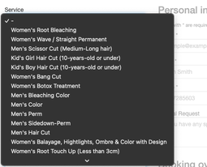

# coiffure-rium

## 2022-09-19 수정사항 
1. 송이씨 앞머리커트 메뉴 추가
2. salonrium.com 도메인 구매 
3. Google calendar 세분화 - 각 worker 별로 calendar 나눔 (custom 색상 가능) 및 각 worker에게 해당 캘린더 공유 가능 
4. Google calendar에 생성되는 이벤트 Subject 및 Description 서로 반전. 
  * 현재 
    * Subject - #e-mail# #name# #phone# #special-request# 
    * Description - #name# #service_name# #worker_name#

## 2022-11-04 Update
1. Announcement
    1. You will get your confirmation in 24 hrs by email. If you didn’t get any notice from us, please check your spam box.
2. Hide Service Cost on Select Menu Booking Window  
      
3. Service Fee Update  
      
    * Botox treatment  180/200/220/240
4. Add Services
    1. BLEACHING WHOLE HAIR (1 TIME)
        1. Wed-Sun 10-16
    2. BLEACHING WHOLE HAIR (2 TIMES)
        1. Wed-Sun 10-15

## 2022-11-20 Update
1. Add Service
    1. ROOT BLEACHING with TONER 2hrs 160~230
    2. Kid's Girl Hair Cut (10-years-old or under) 1hr
    3. Kid's Boy Hair Cut (10-years-old or under) 1hr
2. Remove Service
    1. Men's Scissor cut
3. Adjust start time and end time
    1. Marie: 10:00-17:30 Wed-Sat / 10:00-16:00 Sun
    2. Daniel: 10:00-17:30 Wed-Sat / 10:00-16:00 Sun
    3. Song Yi: 10:00-17:30 Wed-Sat
4. Revamp connection
    1. Marie
        * Include all service but *Women's Blowdry & Styling*
        * Connection id 141~180
    2. Daniel
        * Include all service but *Women's Blowdry & Styling* and *Women's Balayage, Hightlights, Ombre & Color with Design*
        * Connection id 181~219
    3. Song Yi
        * Include all service but all perms
        * Special services that replace regular services
            * Kid's Girl Hair Cut (10-years-old or under) 1hr
            * Kid's Boy Hair Cut (10-years-old or under) 1hr
            * Women's Haircut - 1.5hrs
            * Men's Haircut - 1hrs
        * Connection id 220~236
5. Update format in phone input field
6. Future Update Requirements
    1. Send text message to customers when bookings have been confirmed
    2. Domain Address change from k-beautycare => salonrium
    3. Make booking confirm possible only once in a week
    4. Add deposit system when booking
    
## 2023-01-01 Update
### Schedule
* Start: 2023-01-04
* End: Indefinite
* Details
    * Song-Yi: Wed-Sat 9-5
    * Marie & Daniel: Wed-Fri 9-17 / Sat 9-18 / Sun 9-16

### Service
* Song-Yi
    * Remove all services but Bang-cut, Root Colour, and Regular Colour

### Sort Service Menu 
1. Men's Haircut with Marie - 20분
2. Men's Haircut with Daniel - 30분
3. Women's Haircut with Marie - 40분
4. Women's Haircut with Daniel - 1시간
5. Kid's Cut (Boy/Girl) - 30분
6. Women's Bangcut - 30분
7. Women's Wash and Blow Dry/Styling - 30분 / 55$+
8. Men's Regular Color - 1시간
9. Men's Bleach and Color - 2시간
10. Women's Regular Color - 2시간 
11. Women's Bleach and Color - 3시간
12. Women's Balayage/Ombre/Highlights - 4시간
13. Women's Root Color (Styling not Included) - 1시간
14. Women's Root Bleach without Toner (Styling not Included) - 1시간 30분
15. Women's Root Bleach with Toner (Styling not Included) - 2시간
16. Men's Side Down Perm (Hair cut Included)  - 1시간
17. Men's Wave/Straight Perm (Hair cut Included) - 2시간 / 180-200$
18. Women's Short Hair Wave/Straight Perm (Chin to Shoulder Length, Hair cut Included) - 3시간 / 285$
19. Women's Long Hair Wave/Straight Perm (Below Shoulder Length, Hair cut Included) - 4시간 / 330$
20. Women's Bang Perm - 1시간 30분
21. Women's Root Volume Perm (Hair cut not Included) - 1시간 30분
22. Hair Botox Treatment (Hair cut not Included) - 3시간

### Block service
* 그리구 남자컷트 주말에 막아주세요

## Update Menu 메뉴판 업데이트가 필요해요!
내가 안적어 놓은건 다 날리면 될거같아, 시술 시간변경도 해야하고!

### 팝업공지
* 1월 25일부터 2월 7일까지 그리고 2월 10일부터 2월 21일까지 휴가공지

### Change Domain Name Server
* Previous setting
    * Setup Type: Bluehost
Name Servers
IP Address
ns1.bluehost.com

162.159.24.80

ns2.bluehost.com

162.159.25.175

## Deposit/Payment 
* https://stripe.com/docs/keys#create-api-secret-key
* https://dashboard.stripe.com/account/onboarding/summary
* https://www.youtube.com/watch?v=ZChgOLf3I0U&ab_channel=AppSumo%2FProducts
* https://easy-appointments.net/documentation/paypal-setup-tutorial/

## Requirements
* Appointment Booking/Cancel
    * 
* Vacation
* Admin Dashboard
* Temp Block - Timely/Daily
* Email/SMS Notification
* Gmail/Google calendar Sync
* Payment/Deposit
    * Transaction Fee

Vue React Angular

Firebase AWS 

## Browsing Tech Stacks
1. Ruby on rails
2. MEAN/MERN/MEVN
    1. MongoDB (NoSQL database)
    2. Express.js backend web framework
    3. Angular.js/React.js/Vue.js frontend framework
    4. Node.js server-side JavaScript
3. ASP.NET
    1. ASP.NET MVC – Standard model-view-controller framework
    2. IIS – Microsoft’s web server
    3. Angular frontend framework with TypeScript
    4. SQL Server – Microsoft’s enterprise database
    5. Microsoft Azure – A favorite of most .NET developers
4. LAMP
    1. Linux (operating system)
    2. Apache (HTTP server)
    3. MySQL (relational database management)
    4. PHP (programming language, it can also be Perl or Python)
5. Python
6. Java
### Reference
* https://codeless.co/web-development-stacks/
* https://github.com/justalever/bookme_demo
* https://web-crunch.com/posts/event-scheduling-app-rails-7
* https://rubygems.org/search?query=appointments
* https://github.com/elevation/event_calendar
* https://github.com/benignware/schedulable

## Reference Websites
https://www.fresha.com/a/in-salon-lasalle-montreal-6840-boul-newman-xmbym8am
https://easy-appointments.net/extension-paypal-example/

## 2023-04-17 Update
1. 홈페이지 서비스 Price Update
2. Marie 컷트 시간 변경(여자컷-1.5h 남자컷-1h) ✅
3. Daniel 일요일 남자,여자 커트 막기 ✅

## 2023-04-24 Todo
1. Easy Appointments Service Price/Time Update
2. Perm or color예약 할때 self questionnaire
    * Have you ever bleached before? If your hair is bleached, you are not a good candidate for the perm service, your hair will be severely damaged to melt.
    * Have you ever black or darker color before? It will be affecting your color service if you want to lighten your hair. It takes more time and money.
3. 예약 리마인드 이메일 그리고 문자 24시간 전에 발송 Appointment reminder e-mail and text message at before 24 hours 
    * If you are late for the appointment time, your appointment will be automatically cancelled. (Please be on time to respect other’s time)
        * Ex) Your total service time is 13:00-15:00. You should be at the salon at 13:00.
4. Security deposit equivalent with 30% of your service charge is non-refundable. Once you Deposit your appointment is confirmed, if you want to reschedule let us know at least 48hours before your appointment. (by calling) 
    * Deposit policy
        * FR:Les acomptes ne sont pas remboursables, vous pouvez reporter votre rendez-vous avant 48 heures et votre acompte sera transféré sur votre future réservation. Si vous ne pouvez pas reporter votre rendez-vous, veuillez nous contacter au moins 48 heures avant votre rendez-vous.
        * ENG:Deposits are non-refundable, you can reschedule your appointment before 48 hours and your deposit will be transferred over to your future booking. If you are unable to reschedule, please contact us at least 48 hours before your appointment.

## Deposit and Payment with Paypal
1. Change Service Fee to Deposit
    1. Can we skip $0 payment?: 🟢
    2. What if we have multiple range of service fees?
2. Full Payment?

## Pricing
* Paypal: 2.9% + 0.3 CAD
* Google Domain: $17/year

## PoC
### Ruby
#### App Engine
* https://cloud.google.com/appengine/docs/flexible/ruby/create-app
* Todo: Create another GCP Project and retry the deployment of the sample app
* Google Calender wrapper - Just block the unavailability 
#### Reference
* https://github.com/justalever/bookme_demo
* https://github.com/icalendar/icalendar
* https://www.ruby-toolbox.com/categories/calendars
* https://web-crunch.com/posts/event-scheduling-app-rails-7

## 2023-05-11 Update
* Temp opening
    * Marie, Daniel Men's Haircut used to be closed for afternoon, but temporarily opened. (2023-05-11~2023-05-12)
    * Song Yi Women's Haircut used to be closed completely, but but temporarily opened. (2023-05-11~2023-05-12)
* Research request
    * Collect Credit Card info and charge if no-show, else on-site payment

## Security Deposit
1. Payment 10% or 다 받는 방법
2. Credit Card info ⇒ 호텔처머 이 방법이 좀더 끌림

## 2023-05-20 Research
1. 48시간 전까지만 예약 가능한걸로 되야하고 
2. 24시간 전에 자동 리마인더 메일과 문자가 되야함

## 2023-05-20 Todo
1. Service-Connection Form 
    1. Service Fee ($)
    2. Deposit ($)
    3. Duration (min)
    4. Date and Time
    5. Included?
    6. Notes
2. Twillo 
    1. Virtual number $1.15 monthly fee
    2. To port your number, you need to upgrade
    3. 매장번호로 문자 보내려면 Twilio에서 Porting이란걸 해야되네요 
        https://support.twilio.com/hc/en-us/articles/223179348-Porting-a-Phone-Number-to-Twilio
3. What if we "Cancel" appointment when Paypal payment already went through? 
    1. https://easy-appointments.net/support/does-cancelled-booking-and-rebooking-result-in-a-paypalstripe-refund/

## 2023-05-24 Update
1. Women's Haircut with Marie	60mins 
2. Men's Haircut with Marie     30mins
3. Pop up 2023-05-24~2023-07-31
    * June 1st 부터 남자헤어컷 40$로 가격인상
    * June 1st 부터 secutiry deposit system 시작 ->
    * no show, last minute cancellation 때문에 비지니스 운영에 어려움이 있었음.
    * 48 시간 이전에 취소할 시 디파짓은 환불됨. 
    * 48 시간 이전 예약변경의 경우 디파짓은 다음 예약으로 trasfer
4. Updates
    * 18:00 평일 여자컷트 라스트 어포인먼트 (지금은 18:30 에도 가능하게 되어있음 1시간 소요 되는 서비스 이므로 17:00 closing 할 수 있게 하고싶음) ✅
    * 지금은 online에서 지불할 경우, 지금은 전체금액 payment 가능하게 되어있던데 나중에 변경할 예정? 많이들 헷갈려 하더라고 ✅
    * Songyi 아래 목록 서비스 다 열어주세요! -botox treatment, women's root bleach without toner, woman's root bleach with toner, women's root color, women's bleach and color, women's regular color, men's bleach and color, men's regular color, women's wash and blow Dry/styling, Women's Bangcut, Kid's girl Haircut, Kid's Boy Hair cut, Women's haircut with Songyi ✅
    * color service 의 경우, 헤어컷을 따로 추가하고 싶으면 시간추가 30-40가 필요한데, 이부분을 서비스에서 선택할때 어떻게 해야할지 의논하고 싶어. 중복선택이 안된다면 추가로 시간을 늘릴 수 있게 선택하는 방법이 있을지? ✅
### 2023-05-24 Answer
1. Women's Haircut with Daniel/Marie 현재 마지막으로 선택 가능한 슬롯이 16:00~17:00인데 18:30분에도 예약가능하다는건 어떤 의미실까요? 
2. 나중에 ServiceFee를 Desposit 금액으로 설정해서 Deposit만 Online Payment로 받을것같습니다. e.g., Women's Bang Perm / Service Fee Total $90 / Deposit $30(online) / OnSite Payment $60
3. Colour Service의 경우에는 Women's Regular Color and Haircut과 Women's Regular Color (Haircut not included) 서비스를 따로 만들어야 할 것 같습니다. 현재 웹사이트가 지원하는 기능에는 추가시간을 넣는 기능이 없습니다.

### 2023-05-30 Update
1. Deposit System
2. 24hrs notification Email/문서서비스 Enable
3. Checkbox when checkout 

### 2023-06-01 Update
1. Google Docs 도입
2. Deposit System 도입